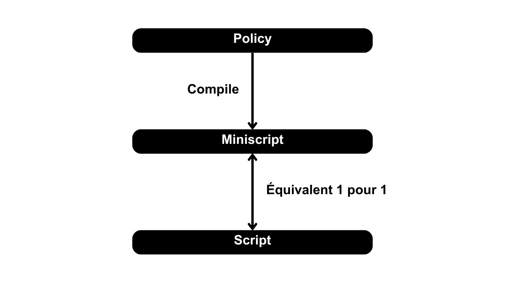

Bitcoin上で安全にスクリプトをプログラミングするためのフレームワークを提供します。Bitcoinのネイティブ言語は「script」と呼ばれます。これは実際に使用するにはかなり複雑で、特に洗練されたカスタムアプリケーションにおいてそうです。特に、スクリプトの制限を検証することは非常に困難です。Miniscriptは、Bitcoinスクリプトのサブセットを使用して、その作成、分析、および検証を簡素化します。各Miniscriptは、1対1でネイティブスクリプトと等価です。使用しやすいPoliciesの言語を使用し、それをMiniscriptにコンパイルし、最終的にネイティブスクリプトに対応させます。

Miniscriptにより、開発者はより安全で信頼性の高い方法で洗練されたスクリプトを構築できます。Miniscriptの主要な特性は以下の通りです：
* スクリプトの静的分析を可能にし、特にそれが許可する支出条件とリソースコストの点で；
* コンセンサスを尊重するスクリプトを実現することができます；
* 異なる支出パスがノードの標準ルールに従っているかどうかを分析できます；
* ウォレットのソフトウェアとハードウェア全体にわたる一般的で理解しやすく、組み合わせ可能な標準を確立します。

Miniscriptプロジェクトは、2018年にPeter Wuille、Andrew Poelstra、およびSanket Kanjalkarによって、Blockstream社を通じて開始されました。Miniscriptは、2022年12月にバージョン24.0でBitcoin Coreウォレットにウォッチオンリーモードで追加され、2023年5月にバージョン25.0で完全に追加されました。
